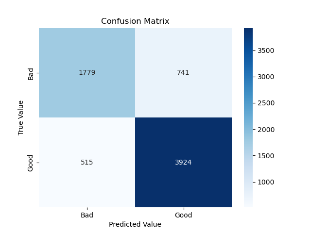

# IMDB web scraping and sentiment analysis with Python

## Web scraper
Using Requests, BeautifulSoup, RegEx and Pandas to extract movie data and user reviews from IMDB's top 250 movies.

## Sentiment analysis
Using scikit-learn's TF-IDF vectorizer to perform sentiment analysis on the scraped reviews. Hyperparameters tuned by cross validation with GridSearch.

## Results
The dataset is imbalanced in favor of positive reviews. As the scraper only gets the reviews from one single page, the distribution of available reviews is dependent on the length of each review string. This indicates that positive reviews in general are much shorter than negative ones. This results in the model is biased towards predicting positive reviews:

#### Accuracy = True predictions / All predictions
Accuracy for bad reviews = 1779 / 2520 = 0.71  
Accuracy for good reviews = 3924 / 4439 = 0.89

## Work in progress
<ul> 
    <li> Case study of one false positive and one false negative to understand better what confuses the model </li>
    <li> Rest API for ratings and reviews for IMDB top 250 </li>

